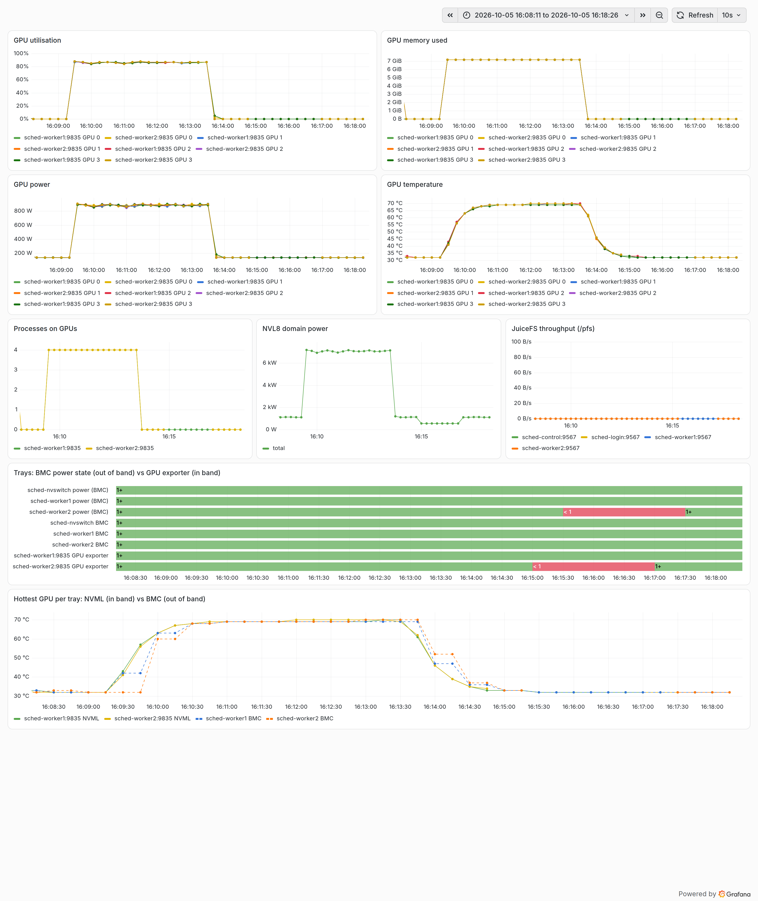
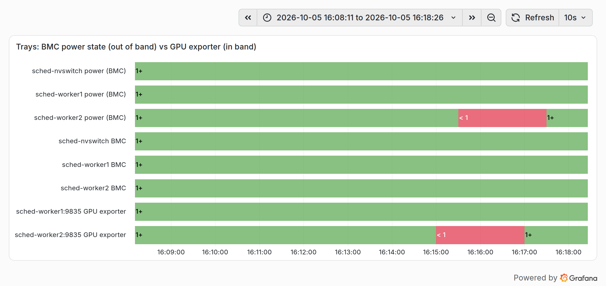
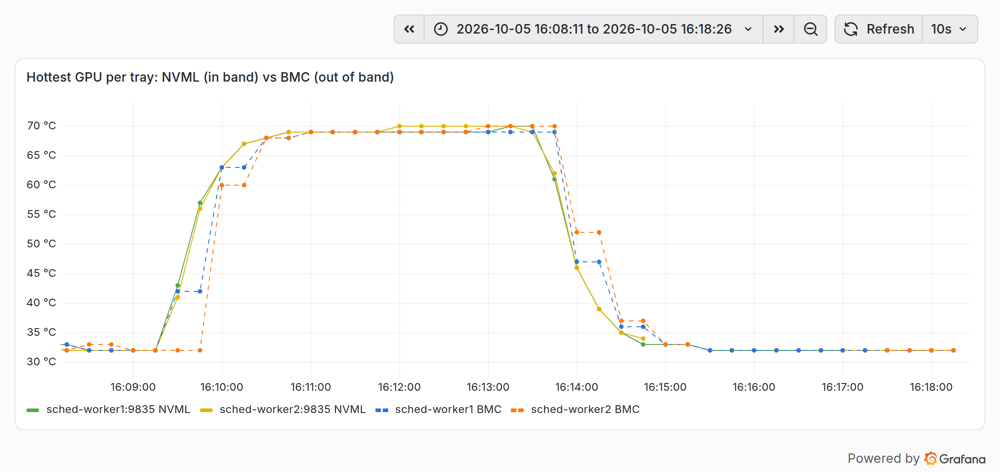
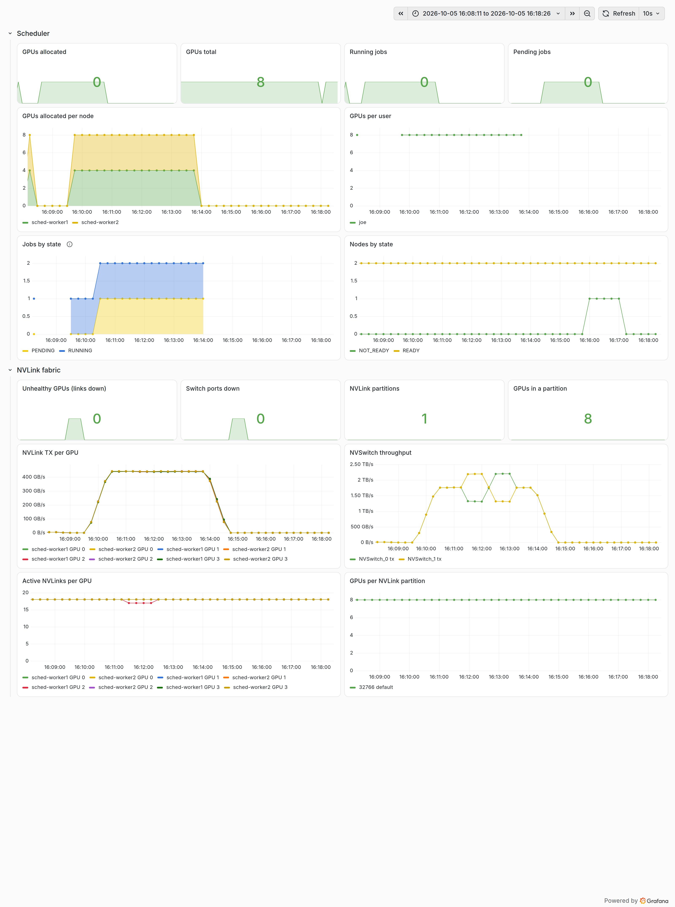
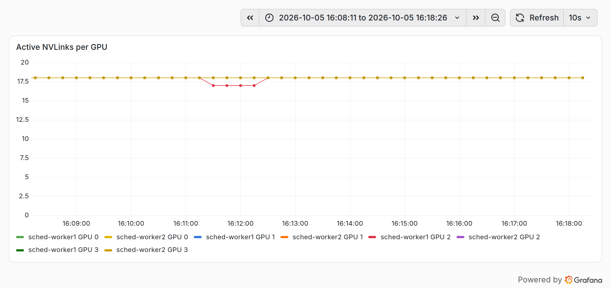

# AI lab, part 6: observing a GPU cluster, layer by layer

*Series: [Intro](01-intro.md) · [Slurm](02-slurm.md) · [Kubernetes](03-kubernetes.md) · [BMC and Redfish](04-bmc-redfish.md) · [NVLink](05-nvlink.md) · **Observability** · [Networking](07-networking.md)*

> Independent personal project, not affiliated with or endorsed by NVIDIA. It emulates NVIDIA hardware interfaces in software for research and education.

The earlier parts each peeked at a metric or two. This one is about monitoring as a whole: which layers of a GPU cluster need watching, what each layer's signals mean, and how to read the lab's Grafana dashboards. The screenshots come from one scripted 10-minute run on the lab in Kubernetes mode. The dashboards are identical in Slurm mode.

## Why one dashboard isn't enough

A GPU cluster can fail you at several layers, and each layer's metrics can look healthy while the one below or above is not:

- **Allocated isn't busy.** The scheduler says all 8 GPUs are taken, but the job holding them is stuck loading data and the GPUs sit idle.
- **Busy isn't healthy.** The GPUs are busy, but one of them lost an NVLink, and a synchronised job runs at the speed of its slowest rank.
- **Healthy isn't reachable.** Every GPU looked fine at the last scrape, but a tray was powered off through its BMC and the scheduler still counts its GPUs ([Part 4](04-bmc-redfish.md)).

So you watch every layer, and you put the layers next to each other. The run below shows the last two.

## The layers and their signals

| Layer | Watch | Lab source |
|---|---|---|
| GPUs | utilisation, memory, power, temperature, processes | `nvidia_gpu_exporter` on each tray (NVML), every 5 s |
| Nodes and storage | CPU, RAM, disk, filesystem throughput | node_exporter; JuiceFS client metrics |
| NVLink fabric | active links per GPU, switch ports up, partitions, traffic | `fakenmxc` on the switch tray host ([Part 5](05-nvlink.md)) |
| Scale-out network (InfiniBand) | port state, link errors, congestion, throughput per HCA | **not in the lab**: the fabric is emulated as topology only, with no traffic or counters ([Part 7](07-networking.md)) |
| Scheduler | GPUs allocated vs total, per user, jobs and nodes by state | Slurm exporter or kube-state-metrics, mapped to `sched_*` series |
| Out of band | tray power state, BMC health, GPU temperature from the BMC | Redfish exporter polling the three BMCs, every 30 s |

Prometheus on `sched-control` scrapes all of it:

```
$ curl -s http://10.107.111.10:9090/api/v1/targets | jq -r '.data.activeTargets[] | "\(.labels.job)\t\(.labels.instance)\t\(.health)"' | sort
gpu	sched-worker1:9835	up
gpu	sched-worker2:9835	up
juicefs	sched-control:9567	up
…
kube-state-metrics	sched-control:30808	up
node	sched-control:9100	up
…
nvlink	sched-nvswitch:9372	up
prometheus	localhost:9090	up
redfish	sched-nvswitch-bmc	up
redfish	sched-worker1-bmc	up
redfish	sched-worker2-bmc	up
```

The scheduler layer has a twist. Slurm and Kubernetes export completely different metrics, so recording rules turn either one into the same handful of series: `sched_gpus`, `sched_gpus_alloc`, `sched_node_gpus_alloc`, `sched_user_gpus`, `sched_jobs{state}` and `sched_nodes{state}`. The dashboards use only those, which is why they work with either scheduler. It's a pattern worth copying if you run both.

The scale-out network is the gap. On a real cluster a degraded InfiniBand link produces stragglers just like a lost NVLink, so its port counters and error rates belong on the same screen as GPU utilisation. The lab has no InfiniBand traffic to measure; the only network metrics are node_exporter's counters for the management Ethernet (`node_network_*_bytes_total`).

The out-of-band layer polls the BMCs, not the trays, through a generic Redfish exporter ([idrac_exporter](https://github.com/mrlhansen/idrac_exporter), which also speaks to OpenBMC). That makes it the one layer that keeps reporting when a tray's OS is gone. It exports `idrac_system_power_on`, system and BMC health, and the BMC's GPU temperature sensors, labelled by tray.

## The scenario

All the screenshots show the same window, in Grafana's local time:

| Time | Event |
|---|---|
| 16:08:11 | idle (the blip at the very left edge of some panels is the end of an earlier test job) |
| 16:09:12 | 8-GPU PyTorch DDP job submitted (2 pods × 4 GPUs, 60,000 steps) |
| 16:10:12 | `nvl8-hello` (8 GPUs) submitted; Kueue queues it, since no GPUs are free |
| 16:11:12 | NVSwitch_0 port 19 disabled through the switch BMC (`sched-worker1` GPU 2, link 2) |
| 16:12:12 | port re-enabled |
| ~16:13:45 | DDP finishes on both trays; `nvl8-hello` runs for a few seconds |
| 16:14:50 | `sched-worker2` cordoned, then powered off through its BMC (`ForceOff`) |
| 16:16:51 | powered on through its BMC; Ready and uncordoned at 16:16:56 |
| 16:18:26 | idle again |

## Reading the GPU layer



**GPU utilisation** is the share of time a kernel was running on the GPU. It isn't a measure of how efficiently the GPU was used. All eight lines jump from 0 to 86–87 % together, stay flat, and drop together when the job ends. That's what healthy data-parallel training looks like: every rank does the same work at the same pace. A line or a group of lines sagging below the pack points to a **straggler**: a slow GPU, a degraded link, or a tray with CPU-side contention. On real hardware NCCL's collectives make every rank wait for the slowest one, so a straggler drags the whole job down while its own GPU looks the least busy. The lesson: compare GPUs against each other, not only against a threshold.

**GPU power** follows utilisation, from about 140 W at idle to 880–890 W per GPU under load. **NVL8 domain power** is the sum: 1.12 kW idle, about 7.1 kW with all eight GPUs working, and 0.56 kW while `sched-worker2` is powered off, because a tray that's off draws nothing. Domain power is the number facilities and capacity planning care about.

**GPU temperature** moves on its own, slower clock: power steps up within one scrape, temperature climbs over about a minute to 68–70 °C and cools gradually after the job ends. That thermal lag is why a temperature alert needs a `for:` duration, and why a GPU that's hot *right after* a job isn't a problem.

**GPU memory used** jumps to about 7 GiB per GPU when the model and optimizer state are allocated, then stays flat: DDP keeps a full copy of the model on every GPU. A line that keeps climbing during training is a leak, and a line close to the 185 GiB capacity is an out-of-memory crash waiting to happen. **Processes on GPUs** shows 4 per tray, one `torchrun` worker per GPU, and drops to 0 when the job ends. Memory or processes that outlive the job mean a leftover process is holding the GPU, and the next job to land there will start with less than it asked for.

## Reading the out-of-band layer

The bottom of the same dashboard puts the BMC's view next to the tray's own:



Each row is a state timeline: green when the series is 1, red when it's 0. When `sched-worker2` was powered off at 16:14:51, the signals changed in this order:

| Time | Signal | Why then |
|---|---|---|
| 16:14:55 | `up{job="gpu"}` for `sched-worker2` → 0 | the GPU exporter on the tray is scraped every 5 s |
| 16:15:25 | `idrac_system_power_on` for `sched-worker2` → 0 | the BMC is polled every 30 s |
| 16:15:50 | node `NotReady` in Kubernetes | the node controller waits for missed heartbeats |
| 16:16:51 | powered on | |
| 16:16:55 | GPU exporter up | |
| 16:17:00 | node Ready | |
| 16:17:25 | BMC reports power on | next 30 s poll |

The `sched-worker2 BMC` row stays green the whole time, and that's the point of the out-of-band layer. Three cases that look the same from the GPU exporter alone can now be told apart:

| `up{job="gpu"}` | `idrac_system_power_on` | `up{job="redfish"}` | Meaning |
|---|---|---|---|
| 0 | 0 | 1 | tray is **off**; the BMC can power it on |
| 0 | 1 | 1 | tray is on but its OS or exporter is down; look at the host |
| any | any | 0 | the **BMC** is unreachable; out-of-band management is lost |

The last panel compares the hottest GPU per tray as NVML reports it (solid) and as the BMC's sensors report it (dashed):



The lab's BMCs read the GPUs' state the way a real BMC reads them over its sideband bus, with the same model as NVML, so the values agree. The dashed lines still trail and step, because the BMC is polled every 30 s instead of every 5 s. Out-of-band data is the slower, coarser view. You keep it because it survives the host, not for its resolution.

## Reading the scheduler and fabric layers



The top row compares supply with demand. The sparklines under **GPUs allocated**, **Running jobs** and **Pending jobs** show the history behind the current value of 0: allocation stays at 8 while the DDP job runs, and *Pending jobs* rises while `nvl8-hello` waits. Allocated close to total with jobs pending means the cluster is full, which is a capacity signal. Allocated below total with jobs pending means the jobs don't fit, either because of topology or quotas ([Part 3](03-kubernetes.md#operations)) or because a node is out.

**GPUs total** is the trap in this row. It stayed at 8 while `sched-worker2` was off: Kubernetes keeps reporting a NotReady node's allocatable GPUs, so the capacity series only dipped to 4 for a moment as the tray came back (16:17:05–16:17:20). Read *GPUs total* together with **Nodes by state**, where the NOT_READY band (16:15:50–16:17:00) shows the tray was gone.

**GPUs allocated per node**, **Jobs by state** and **Nodes by state** are stacked: each series is drawn on top of the previous one, so the top edge is the total and each band is one series' share. *GPUs allocated per node* reaches 8 as two bands of 4, and the top line isn't `sched-worker2` holding 8 GPUs. *Jobs by state* leaves out completed jobs, whose ever-growing count would flatten everything else: the DDP job runs (blue), and `nvl8-hello` sits underneath as pending (yellow) until the DDP job is done. Check whether a panel is stacked before you read a value off it.

**GPUs per user** shows who holds the GPUs: `joe`, all 8 of them. Next to utilisation, this panel answers the classic shared-cluster question: who is holding GPUs without using them? In this run the answer is nobody: `joe` holds all 8, and all 8 are busy.

The **NVLink fabric** row turns Part 4's experiment into graphs. While the switch port is down, **Active NVLinks per GPU** shows `sched-worker1` GPU 2 dropping from 18 to 17 for that minute, and the *Unhealthy GPUs* and *Switch ports down* sparklines show the same minute:



Utilisation didn't move when the link went down. In the lab, the fake NCCL doesn't slow a rank down for a lost link ([Part 5](05-nvlink.md)). On real hardware it may, and a rank missing 1 of 18 links is exactly the kind of fault you only catch by watching the fabric layer.

**NVLink TX per GPU** shows the all-reduce traffic: about 440 GB/s per GPU, the same on both trays. **NVSwitch throughput** shows the same traffic from the switch side, about 1.76 TB/s per chip. The two chips' lines diverge for a couple of minutes around the port change (about 1.3 and 2.2 TB/s): the lab attributes each GPU's traffic to its active links on each switch, so a link going down or coming back shifts the split between the chips. **GPUs per NVLink partition** stays at 8 in the default partition; a split like the one in Part 5 would show up there as two lines.

## Queries worth keeping

```
sched_gpus_alloc / sched_gpus                                   # how full is the cluster
sched_user_gpus                                                 # who holds the GPUs
avg by (instance) (nvidia_smi_utilization_gpu_ratio)            # are allocated GPUs busy (and equally busy)
count(nvlink_gpu_healthy == 0)                                  # GPUs with links down
count(nvswitch_port_up == 0)                                    # switch ports down
up{job="gpu"} == 0                                              # tray not answering in band
idrac_system_power_on == 0                                      # tray powered off (BMC view)
up{job="redfish"} == 0                                          # BMC unreachable
```

First alerts to write:

- a tray off (`idrac_system_power_on == 0`) or not answering in band (`up{job="gpu"} == 0` for 1m), with the BMC's answer deciding which runbook to follow;
- a BMC unreachable;
- any unhealthy GPU or switch port down;
- GPUs allocated but below 10 % utilisation for 30 minutes (idle reservations);
- one tray's utilisation far below the others' during the same job (stragglers);
- temperature over a threshold `for: 5m`.

## What the numbers are

Everything above is simulated: utilisation comes from simulated busy time, power and temperature are modelled from utilisation by the same formulas in NVML and the BMCs, and NVLink bytes are counted rather than sent. The shapes are realistic enough to build dashboards, alerts and runbooks against, but none of the absolute values say anything about real GB200 performance.

## Next in the series

[Part 7: Networking](07-networking.md) covers the scale-out side: the emulated InfiniBand fabric, how topology reaches the scheduler, and what the lab doesn't model, from RDMA traffic to BlueField DPUs.
