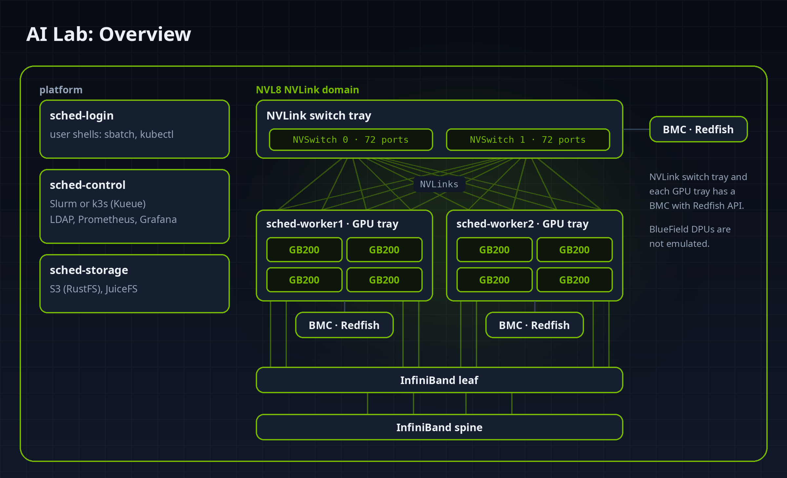

+++
title = "AI lab, part 1: a GB200 GPU cluster on your laptop (minus the GPUs)"
date = 2026-09-28
description = "A GB200-class GPU cluster emulated on a single Linux machine: what it is, what you can practise with it, and how to set it up."

[extra]
social_media_card = "card.png"
# Thumbnail in the post list.
local_image = "ai-lab/01-intro/card.png"
+++

Most of the work in AI infrastructure isn't the GPUs. It's everything around them: the scheduler that places an 8-GPU job inside one NVLink domain, the BMC you power-cycle a tray through at 3 a.m., the dashboard that shows which user is holding 6 of the 8 GPUs, the runbook for a degraded NVLink. Systems engineers who want to learn this hit a wall quickly: you can't practise on a GB200 rack you don't have, and cloud GPU instances hide exactly the layers you want to touch.

Most of those layers never use a GPU for computation. Slurm reads a GPU count from its configuration and sets `CUDA_VISIBLE_DEVICES` for each job. The monitoring exporter calls NVML, NVIDIA's management library. The BMC answers Redfish requests over HTTPS. All of that works against GPUs that answer the right API calls, whether or not they compute anything.

[ai-lab](https://github.com/arkady-emelyanov/ai-lab) is my attempt at a way around that wall. It's a complete GPU cluster that runs on a single Linux machine. The GPUs are emulated, and everything around them is real. It works like a stub in a unit test: the GPU stack is replaced with an implementation of the same APIs, and the rest of the cluster runs against it unchanged.



## What the lab is made of

The hardware side is one NVIDIA GB200-class **NVL8** NVLink domain. An NVLink domain is a set of GPUs that can all reach each other over NVLink, even across trays, without going through the network. It's the unit a scheduler has to respect when it places a multi-GPU job. The lab's domain has:

- 2x GPU compute trays with 4x GB200 GPUs each,
- an NVLink switch tray with two NVSwitch chips (144 ports),
- a Redfish BMC for every tray,
- an InfiniBand fabric (one leaf, one spine).

On top of that hardware runs the software of a real GPU cluster:

- **Slurm** or **Kubernetes** (k3s with Kueue) for scheduling,
- OpenLDAP for users,
- a shared filesystem, per-user S3 buckets and node-local scratch for storage,
- Prometheus and Grafana for monitoring.

Everything runs in Incus containers, set up by Ansible behind a `Makefile`. These are the same components a real cluster runs, except the Kubernetes device plugin, which the lab replaces with its own ([Part 3](@/ai-lab/03-kubernetes/index.md)).

## Where the emulation stops

Each GPU tray has `/dev/nvidia0-3` and stub versions of NVIDIA's software: the CUDA driver, NVML, cuBLAS, cuDNN, NCCL and `nvidia-smi`. The stubs implement the real APIs, so PyTorch and Ray run unmodified on top of them.

The stubs also model timing and telemetry, because schedulers, dashboards and timeouts depend on both:

- every call succeeds and takes **realistic time**: a matrix multiply takes about as long as it would on a GB200, an all-reduce as long as NVLink bandwidth allows;
- while a job runs, the GPUs report load, memory, power and temperature that rise and fall with it.

Nothing is actually computed: tensors hold zeros, so the numbers from a training run mean nothing. Everything around the numbers works: scheduling, GPU binding, accounting, monitoring, failure handling and out-of-band management.

From the scheduler's point of view, a tray looks like this:

```console
$ bin/ssh sched-worker1 nvidia-smi topo -m
	GPU0	GPU1	GPU2	GPU3	CPU Affinity	NUMA Affinity	GPU NUMA ID
GPU0	X	NV18	NV18	NV18	0-3	0		N/A
GPU1	NV18	X	NV18	NV18	0-3	0		N/A
GPU2	NV18	NV18	X	NV18	0-3	0		N/A
GPU3	NV18	NV18	NV18	X	0-3	0		N/A
```

`NV18` means the two GPUs are connected through 18 NVLinks. The matrix reflects the lab's current state, so changes made through other interfaces show up in it. If you disable two of a GPU's NVLinks through the BMC, `NV18` turns into `NV16` for that GPU. If you move a tray into its own NVLink partition, Slurm's block topology or Kubernetes' node labels change within a minute. Parts 4 and 5 are built around that feedback loop.

## What you can practise

- **Scheduler work.** Write and test job portals, quota tools, scheduler plugins and user CLIs against a real Slurm (GRES, accounting, `topology/block`) or a real Kubernetes setup (device plugin, GPU Feature Discovery, Kueue topology-aware scheduling, JobSet).
- **Monitoring and operations.** Build dashboards and alerts on realistic GPU, scheduler and NVLink metrics, and rehearse drains, power cycles, link failures and partition changes.
- **Hardware management tooling.** Point Redfish clients and BMC automation at three BMCs modelled on NVIDIA's OpenBMC fork, and drive an NMX-C-style partition controller over gRPC.
- **AI pipelines.** Run PyTorch DDP and Ray end to end on 8 GPUs to test orchestration, data movement and failure handling. The numerics are meaningless, but the plumbing is real.
- **CI for infrastructure code.** `make up && make test` builds and verifies the whole cluster from scratch.

## Requirements

- Linux with [Incus](https://linuxcontainers.org/incus/), plus `make`, Python 3, Go, `jq` and git.
- Your user in the `incus-admin` group.
- **RAM:** 16 GiB free (the running lab uses about 10 GiB).
- **CPU:** 4 cores or more.
- **Disk:** about 25 GB under `/var/lib/incus`, which includes a 5.6 GB PyTorch/Ray virtualenv.

You don't need a GPU, an NVIDIA driver or a cloud account.

## Setup

Clone the repository and check the host first:

```
git clone https://github.com/arkady-emelyanov/ai-lab.git && cd ai-lab
make check
```

If something is missing, `make check` prints the command for you to run. Usually that's adding your user to a group, an AppArmor rule for Incus DNS, or raising a couple of kernel limits. Run `make check` again until it passes:

```console
$ make check
host ready
```

Prepare the host side (Ansible venv, secrets, Go builds):

```
make init
```

Choose the scheduler. One line in `inventory/group_vars/all.yml` picks it:

```yaml
scheduler: slurm        # or: k3s
```

Then build the cluster:

```
make up            # create and configure the cluster (~15 minutes)
make frameworks    # PyTorch + Ray on the shared volume (optional, several GB)
make test          # end-to-end checks
```

To switch the scheduler on a built cluster, run `make down`, change the line, then `make up`. Volumes survive the rebuild, so homes, the frameworks venv and object data are kept. The two modes never run side by side, but everything below the scheduler (GPUs, BMCs, fabric, storage, monitoring) is identical.

## First contact

When `make up` finishes, you have nine containers, each with a pinned address:

```console
$ incus list --all-projects -c ns4 -f compact
         NAME          STATE           IPV4
  sched-control       RUNNING  10.107.111.10 (eth0)
  sched-login         RUNNING  10.107.111.11 (eth0)
  sched-nvswitch      RUNNING  10.107.111.34 (eth0)
  sched-nvswitch-bmc  RUNNING  10.107.111.33 (eth0)
  sched-storage       RUNNING  10.107.111.12 (eth0)
  sched-worker1       RUNNING  10.107.111.21 (eth0)
  sched-worker1-bmc   RUNNING  10.107.111.31 (eth0)
  sched-worker2       RUNNING  10.107.111.22 (eth0)
  sched-worker2-bmc   RUNNING  10.107.111.32 (eth0)
```

These map one to one onto the overview picture: the two GPU trays are `sched-worker1` and `sched-worker2`, the switch tray is `sched-nvswitch`, and every tray has its own `-bmc` container. The lab has one regular user, `joe`, an OpenLDAP account that works on every node. The rest of the series uses `joe` for everything a cluster user would do. The `bin/` wrappers look the addresses up in Incus, so you never need to type them:

```
bin/ssh login                    # login node as joe (joe's lab key, no password)
bin/ssh root@sched-worker1       # any instance as root, with the generated admin key
bin/redfish sched-worker1 /redfish/v1/Systems/System_0
```

A tray looks like any other GPU node:

```console
$ bin/ssh sched-worker1 nvidia-smi
+-----------------------------------------------------------------------------------------+
| NVIDIA-SMI 580.95.05          Driver Version: 580.95.05          CUDA Version: 13.0     |
+-----------------------------------------+------------------------+----------------------+
…
|   0  NVIDIA GB200                    On | 0000:18:00.0       Off |                    0 |
| N/A   32C    P8            138W / 1200W |     512MiB / 189471MiB |      0%      Default |
…
```

All of these values come from the stub NVML, including the driver version, the 189,471 MiB of memory and the 1,200 W power limit. The trays idle at about 140 W and 32 °C. Start a job and those numbers climb, and the same values show up in Prometheus (`http://10.107.111.10:9090`) and Grafana (`http://10.107.111.10:3000`, user `admin`, password in `.secrets/grafana.pass`). Keep the **Lab overview** dashboard open while you work through the rest of the series.

## What it is not

It's not a performance model. Timings are approximations, and the emulated NCCL ranks never talk to each other, so a dead peer doesn't hang a collective the way it would on real hardware. It's also not a scale model: it has one NVLink domain, one switch tray and one InfiniBand leaf, which is enough to exercise every interface but nothing more. Containers share the host kernel, so Slurm jobs aren't cgroup-confined, and the Kubernetes GPUs come from the lab's own device plugin rather than NVIDIA's. The repository's README lists the remaining limitations.

## Next in the series

[Part 2: Slurm](@/ai-lab/02-slurm/index.md) covers the scheduler: how Slurm is configured for GPUs, running jobs from `srun` up to PyTorch DDP across both trays, draining and resuming nodes, and watching it all in Prometheus.
