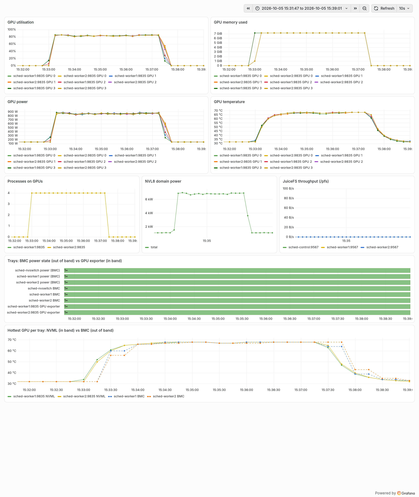
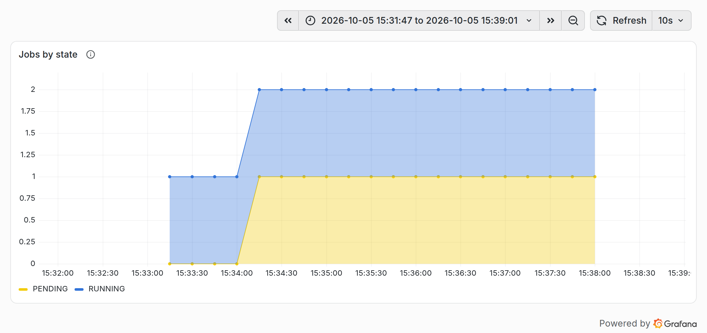

+++
title = "AI lab, part 2: running an emulated GB200 cluster with Slurm"
description = "Running the emulated GB200 cluster with Slurm: GPU scheduling, jobs from srun to PyTorch DDP, drains, quotas and monitoring."

[extra]
social_media_card = "card.png"
+++

[Part 1](@/ai-lab/01-intro/index.md) introduced the lab: one NVL8 NVLink domain with two trays of four fake GB200 GPUs, running on a single Linux machine. This post covers the default scheduler, Slurm 23.11. We'll read the cluster's state, look at how it's configured for GPUs, run jobs from a one-liner up to PyTorch DDP across both trays, do some routine operations, and watch all of it in Prometheus.

Commands prefixed with `$` run on the login node as the directory user `joe` (`bin/ssh login`). Commands that start with `bin/` run from the repository root on the host.

## Runtime information

```
$ sinfo
PARTITION AVAIL  TIMELIMIT  NODES  STATE NODELIST
gpu*         up   infinite      2   idle sched-worker[1-2]

$ sinfo -N -o "%N %G %c %m %d %T"
NODELIST GRES CPUS MEMORY TMP_DISK STATE
sched-worker1 gpu:gb200:4 4 7500 51200 idle
sched-worker2 gpu:gb200:4 4 7500 51200 idle
```

There is one partition with two nodes. Each node has four GPUs of type `gb200`, 4 cores, 7.5 GB of schedulable memory and 50 GB of node-local scratch. `scontrol show node` gives the full picture, including what's allocated right now:

```
$ scontrol show node sched-worker1
NodeName=sched-worker1 Arch=x86_64 CoresPerSocket=4
   …
   Gres=gpu:gb200:4
   RealMemory=7500 AllocMem=0 FreeMem=9109 Sockets=1 Boards=1
   State=IDLE ThreadsPerCore=1 TmpDisk=51200 Weight=1 Owner=N/A MCS_label=N/A
   Partitions=gpu
   CfgTRES=cpu=4,mem=7500M,billing=4,gres/gpu=4
   AllocTRES=
```

Accounting is enforced, so a user without an association can't submit anything. `joe` belongs to the account `lab`:

```
$ sacctmgr -n show assoc user=joe format=cluster,account,user,qos
      nvl8        lab        joe               normal
```

## How it's configured

The configuration is short. These are the lines that matter for GPUs, from `/etc/slurm/slurm.conf` on `sched-control`:

```
SelectType=select/cons_tres
SelectTypeParameters=CR_Core_Memory
DefMemPerCPU=1875
GresTypes=gpu
TopologyPlugin=topology/block
TmpFS=/scratch
AccountingStorageEnforce=associations,limits,qos
AccountingStorageTRES=gres/gpu
ProctrackType=proctrack/linuxproc
TaskPlugin=task/none
NodeName=sched-worker1,sched-worker2 … RealMemory=7500 TmpDisk=51200 Gres=gpu:gb200:4
```

- **`cons_tres`** schedules CPUs, memory and GPUs as separate trackable resources, so two jobs can share a tray.
- **`gres.conf`** maps each GPU to its device node and tells Slurm that every pair is connected by 18 NVLinks, matching what `nvidia-smi topo -m` reports:

  ```
  NodeName=sched-worker1,sched-worker2 Name=gpu Type=gb200 File=/dev/nvidia0 Links=-1,18,18,18
  …
  ```

- **`topology/block`** is the setting that matters for NVL-class systems. A block is a set of nodes that share an NVLink partition, and Slurm keeps jobs that fit in one block inside it. Nobody writes `topology.conf` by hand here. NVIDIA's [topograph](https://github.com/dsx-ai-factory/topograph) generates it every minute from the live fabric (more on that in [Part 5](@/ai-lab/05-nvlink/index.md)):

  ```
  $ scontrol show topology
  BlockName=block001 BlockIndex=0 Nodes=sched-worker[1-2]
  ```

- **`AccountingStorageTRES=gres/gpu`** records GPU usage per job, user and account.
- **`proctrack/linuxproc` and `task/none`** have a lab-specific reason: the trays are unprivileged containers, so Slurm has no cgroups to confine jobs. GPU isolation therefore comes from `CUDA_VISIBLE_DEVICES`, which the fake CUDA driver honours.

## Simple jobs

**Binding.** Ask for 8 tasks with one GPU each and check what every task receives:

```
$ srun -N2 --ntasks-per-node=4 --gpus-per-task=1 bash -c 'echo $(hostname) $CUDA_VISIBLE_DEVICES' | sort
sched-worker1 0
sched-worker1 1
sched-worker1 2
sched-worker1 3
sched-worker2 0
sched-worker2 1
sched-worker2 2
sched-worker2 3
```

**What CUDA sees.** A job that asks for two GPUs sees two GPUs:

```
$ srun -N1 --gpus-per-node=2 bash -c 'echo CVD=$CUDA_VISIBLE_DEVICES;
    /shared/venv/bin/python -c "import torch; print(torch.cuda.device_count())"'
CVD=0,1
2
```

`nvidia-smi` inside the same job still lists all four GPUs on the tray. Real `nvidia-smi` ignores `CUDA_VISIBLE_DEVICES` too, and without cgroup device confinement nothing hides the other device nodes. Keep that in mind if you write tooling that counts GPUs.

**A batch job across the domain.** The examples from the repository (`bin/scp -r examples login:`) include `nvl8-hello.sbatch`, which runs eight tasks with one GPU each. Every task reports its GPU's UUID and NVLink clique:

```
$ cd examples/slurm && sbatch --wait nvl8-hello.sbatch
Submitted batch job 14
$ cat nvl8-hello-14.out
job 14 on sched-worker[1-2]: 8 tasks
0: rank 0 on sched-worker1 CUDA_VISIBLE_DEVICES=0: NVIDIA GB200, GPU-81501924-f170-f6d0-f2da-dc7595876881, 1, scratch  198G
1: rank 1 on sched-worker1 CUDA_VISIBLE_DEVICES=1: NVIDIA GB200, GPU-8150a4ae-478e-5534-f66c-621a95f85f59, 1, scratch  198G
…
7: rank 7 on sched-worker2 CUDA_VISIBLE_DEVICES=3: NVIDIA GB200, GPU-814804a5-291e-ba91-a4e9-01fb69ea739b, 1, scratch  198G
```

All eight GPUs are in clique `1`, which is the same NVLink partition.

**PyTorch DDP on 8 GPUs.** `ddp-train.sbatch` starts one `torchrun` per tray, with four ranks each, NCCL as the backend and rendezvous on the first node. It needs the frameworks venv (`make frameworks`), and extra arguments go straight to the training script:

```
$ sbatch ddp-train.sbatch --steps 60000
Submitted batch job 2
$ grep -E "^step +(10|50|60000) |rank 0/" ddp-train-2.out
step   10      4.2 ms    120783 samples/s      49 TFLOP/s/GPU
step   50      4.4 ms    115140 samples/s      46 TFLOP/s/GPU
step 60000      4.4 ms    115881 samples/s      47 TFLOP/s/GPU
rank 0/8 on sched-worker1 cuda:0 (NVIDIA GB200) peak mem 7.1 GiB
```

The step time comes from the simulated cost of the GEMMs and the all-reduce. Change `--width` or `--batch` and it moves roughly the way it would on real hardware. The loss values are meaningless, since nothing is computed.

## Operations

**Accounting.** Every job is recorded with its GPU allocation:

```
$ sacct -X -o JobID,JobName,User,Account,AllocTRES%45,Elapsed,State
2             ddp-train       joe        lab  billing=8,cpu=8,gres/gpu=8,mem=15000M,node=2   00:04:41  COMPLETED
3            nvl8-hello       joe        lab  billing=8,cpu=8,gres/gpu=8,mem=15000M,node=2   00:00:01  COMPLETED
```

**Draining a node for maintenance.** Run these as root on the controller (`bin/ssh sched-control`):

```
# scontrol update nodename=sched-worker2 state=drain reason="maintenance: BMC firmware"
# sinfo -R
REASON               USER      TIMESTAMP           NODELIST
maintenance: BMC fir root      2026-10-05T19:31:07 sched-worker2
```

A job that needs both trays now waits, and Slurm says why:

```
$ sbatch -J two-trays -N2 --gpus-per-node=4 --wrap "nvidia-smi -L"
$ squeue
JOBID PARTITION     NAME     USER ST  TIME  NODES NODELIST(REASON)
   17       gpu two-tray      joe PD  0:00      2 (Nodes required for job are DOWN, DRAINED or reserved for jobs in higher priority partitions)
```

`scontrol update nodename=sched-worker2 state=resume` brings the node back, and job 17 runs within seconds. In [Part 4](@/ai-lab/04-bmc-redfish/index.md) we power-cycle a tray through its BMC, which is the other half of this runbook.

**GPU quotas.** Limits live on associations. Cap `joe` at four GPUs:

```
# sacctmgr -i modify user joe set GrpTRES=gres/gpu=4
$ sbatch -J big -N2 --gpus-per-node=4 --wrap "sleep 5"
$ sbatch -J small -N1 --gpus-per-node=4 --wrap "sleep 5"
$ squeue -o "%.5i %.8j %.2t %.20R"
JOBID     NAME ST     NODELIST(REASON)
   18      big PD       (AssocGrpGRES)
   19    small  R        sched-worker1
```

The 8-GPU job waits on `AssocGrpGRES` while the 4-GPU job runs. `GrpTRES=gres/gpu=-1` removes the limit again. This is a cheap place to test a quota tool or a fair-share policy before you try it on a cluster people depend on.

## Monitoring

While the 60,000-step DDP job runs, the tray looks busy:

```
$ bin/ssh sched-worker1 nvidia-smi --query-gpu=index,utilization.gpu,memory.used,power.draw,temperature.gpu --format=csv
index, utilization.gpu [%], memory.used [MiB], power.draw [W], temperature.gpu
0, 79 %, 7850 MiB, 813.26 W, 67
1, 81 %, 7850 MiB, 850.17 W, 68
…
$ bin/ssh sched-worker1 nvidia-smi --query-compute-apps=pid,process_name,used_memory --format=csv
pid, process_name, used_memory [MiB]
10404, /shared/venv/bin/python, 7338 MiB
…
```

Compare that with the idle numbers from Part 1 (about 140 W, 32 °C, 0 %). Prometheus (`http://10.107.111.10:9090`) scrapes the same values through the GPU exporter, and it also scrapes the Slurm exporter and a small GPU-allocation collector. Recording rules turn these into **scheduler-neutral** `sched_*` series, which the dashboards are built on. With the DDP job running and `nvl8-hello` (job 3) waiting behind it:

| Query | Value during the job |
|---|---|
| `sched_gpus_alloc` | `8` |
| `sched_user_gpus` | `{user="joe"} 8` |
| `sched_jobs` | `RUNNING 1`, `PENDING 1` |
| `sum by (instance) (nvidia_smi_utilization_gpu_ratio)` | `3.32` and `3.38` per tray (4 GPUs × ~80 %) |
| `sum(rate(nvlink_gpu_tx_bytes_total[1m]))` | ~3.4 TB/s of all-reduce traffic over NVLink |

In Grafana (`http://10.107.111.10:3000`), **Lab overview** shows the per-GPU curves. In this run, all eight GPUs move together: utilisation jumps to 80–85 %, power to 810–870 W per GPU (about 7 kW for the domain), temperature climbs to 67–68 °C over a minute, and memory and processes appear as the job starts and disappear when it ends:



**Scheduler & NVLink fabric** shows allocated versus total GPUs, GPUs per user and jobs by state. Here `nvl8-hello` waits as pending (yellow) under the running DDP job (blue) until the GPUs free up:



Draining a node or submitting a job that can't run shows up there too, which makes the lab a convenient sandbox for building alerts. [Part 6](@/ai-lab/06-observability/index.md) walks through both dashboards panel by panel.

## Next in the series

[Part 3: Kubernetes](@/ai-lab/03-kubernetes/index.md) rebuilds the same hardware with k3s, Kueue and JobSet, and runs the same four jobs as pods.
