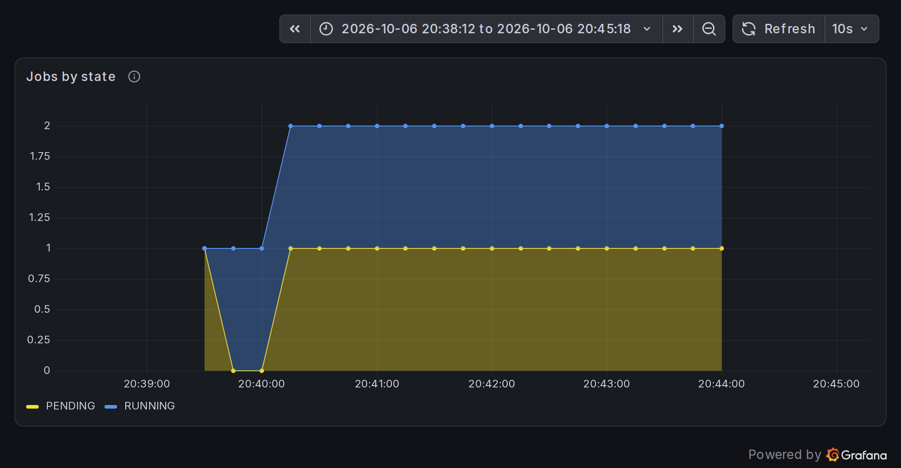

+++
title = "AI lab, part 3: the same GPU cluster on Kubernetes, with Kueue and JobSet"
date = 2026-09-30
description = "The same emulated GPU cluster on Kubernetes: GPU pods, Kueue topology-aware queueing, JobSet and monitoring."

[extra]
social_media_card = "card.png"
# Thumbnail in the post list.
local_image = "ai-lab/03-kubernetes/card.png"
+++

[Part 2](@/ai-lab/02-slurm/index.md) ran the lab under Slurm. This part rebuilds the same emulated hardware (two trays of four fake GB200 GPUs, one NVLink domain) with Kubernetes. We'll look at how GPUs and NVLink topology show up as Kubernetes objects, run the same jobs as pods, and see how Kueue queues them.

To switch, set `scheduler: k3s` in `inventory/group_vars/all.yml`, then run `make down && make up` ([Part 1](@/ai-lab/01-intro/index.md#setup)). Commands prefixed with `$` run on the login node as `joe` (`bin/ssh login`), whose kubeconfig and namespace are already set up. `bin/kubectl` on the host is cluster admin.

## Runtime information

```
$ kubectl get nodes -L nvidia.com/gpu.clique,accelerator.topograph.run/domain
NAME            STATUS   ROLES           AGE     VERSION        GPU.CLIQUE                               DOMAIN
sched-control   Ready    control-plane   7m39s   v1.36.5+k3s1
sched-worker1   Ready    <none>          7m24s   v1.36.5+k3s1   7f3c2a10-5b4e-4d6a-9c1e-2b8f0e6d4a91.1   7f3c2a10-5b4e-4d6a-9c1e-2b8f0e6d4a91.1
sched-worker2   Ready    <none>          7m24s   v1.36.5+k3s1   7f3c2a10-5b4e-4d6a-9c1e-2b8f0e6d4a91.1   7f3c2a10-5b4e-4d6a-9c1e-2b8f0e6d4a91.1
```

The two trays are worker nodes. The controller runs the control plane and add-ons, and is tainted so pods don't land on it. Both trays carry the same NVLink clique, and two different components publish it. `nvidia.com/gpu.clique` comes from NVIDIA's GPU Feature Discovery (GFD), which reads it from NVML. `accelerator.topograph.run/domain` comes from topograph, which rebuilds it from the live NVLink and InfiniBand fabric every minute.

```
$ kubectl get nodes -o custom-columns='NODE:.metadata.name,GPU:.status.allocatable.nvidia\.com/gpu,PRODUCT:.metadata.labels.nvidia\.com/gpu\.product,MEM:.metadata.labels.nvidia\.com/gpu\.memory'
NODE            GPU      PRODUCT        MEM
sched-control   <none>   <none>         <none>
sched-worker1   4        NVIDIA-GB200   189471
sched-worker2   4        NVIDIA-GB200   189471
```

GFD adds about 25 more `nvidia.com/*` labels per tray, all derived from the fake NVML: `gpu.family=blackwell`, `gpu.compute.major=10`, `cuda.driver-version.full=580.95.05`, `cuda.runtime-version.full=13.0` and so on. topograph adds the InfiniBand tiers (`fabric.topograph.run/tier-0` and `tier-1`, the leaf and spine).

Queues:

```
$ kubectl get clusterqueues; kubectl get localqueues
NAME   COHORT   PENDING WORKLOADS
gpu             0
NAME      CLUSTERQUEUE   PENDING WORKLOADS   ADMITTED WORKLOADS
default   gpu            0                   0
gpu       gpu            0                   0
```

`joe` works in the `joe` namespace. They can create pods and JobSets there and read nodes and queues, but they can't touch other namespaces or cluster-wide queue objects:

```
$ kubectl auth can-i create jobsets.jobset.x-k8s.io
yes
$ kubectl auth can-i create pods -n kube-system
no
```

## How it's configured

| Piece | What it does |
|---|---|
| k3s 1.36 | control plane on `sched-control`, agents on the trays, all in unprivileged Incus containers |
| `fakedp` + CDI | device plugin advertising `nvidia.com/gpu` (4 per tray); each GPU is a CDI device in `/etc/cdi/fakegpu.json` that injects `/dev/nvidia<n>` and the fake driver |
| Node Feature Discovery + GPU Feature Discovery | the real NVIDIA/upstream components, labelling trays from NVML |
| topograph | labels NVLink domain and InfiniBand tiers every minute |
| Kueue | ClusterQueue `gpu` (8 CPUs, 18 GiB, 8 GPUs); in each user namespace a LocalQueue `gpu` and a `default` one for workloads without a queue label; topology-aware scheduling |
| JobSet | multi-pod jobs with stable DNS names for rank 0 |

The device plugin is the lab's own. NVIDIA's device plugin and container toolkit expect a real driver installation, so the lab ships a small replacement that hands out GPUs by UUID through CDI:

```
$ bin/ssh sched-worker1 'jq -c "{kind, devices: [.devices[].name]}" /etc/cdi/fakegpu.json'
{"kind":"nvidia.com/gpu","devices":["0","GPU-81501924-f170-f6d0-f2da-dc7595876881","1","GPU-8150a4ae-…", …]}
```

Kueue is where the topology awareness lives. Its `Topology` object, `nvl`, orders the node labels from coarse to fine:

```
$ bin/kubectl get topology nvl -o jsonpath='{.spec.levels}' | jq -c '[.[].nodeLabel]'
["fabric.topograph.run/tier-1","fabric.topograph.run/tier-0","accelerator.topograph.run/domain","kubernetes.io/hostname"]
```

A workload annotated with `kueue.x-k8s.io/podset-required-topology: accelerator.topograph.run/domain` is admitted only if all its pods fit inside one NVLink domain. The pods of a multi-pod job are admitted together, as a gang, or not at all.

## Simple jobs

**A single GPU pod.** No Kueue and no JobSet, just a pod asking for two GPUs:

```yaml
apiVersion: v1
kind: Pod
metadata:
  name: gpu-pod
spec:
  restartPolicy: Never
  containers:
    - name: smi
      image: mirror.gcr.io/library/buildpack-deps:noble
      command: [nvidia-smi, -L]
      resources:
        limits: {nvidia.com/gpu: 2}
```

```
$ kubectl apply -f gpu-pod.yaml
$ kubectl logs gpu-pod
GPU 0: NVIDIA GB200 (UUID: GPU-8150a4ae-478e-5534-f66c-621a95f85f59)
GPU 1: NVIDIA GB200 (UUID: GPU-81502f39-9cad-de97-2723-3d7d71928458)
```

The pod sees exactly two GPUs. They are physical GPUs 1 and 2 of `sched-worker1`, renumbered 0 and 1, just as with the real driver. `nvidia-smi` and CUDA agree on what the pod has, because CDI only injects the allocated device nodes. The pod has no queue label, but Kueue still takes it: it goes to the namespace's `default` LocalQueue and is admitted against the same ClusterQueue quota as everything else, so nobody can grab GPUs by skipping the queue:

```
$ kubectl get workloads | grep gpu-pod
pod-gpu-pod-c7498                  default   gpu           True       True       3s
```

I use `mirror.gcr.io` because it serves the same image as Docker Hub (identical digest) without Docker Hub's anonymous pull limits. The repository's examples still say `docker.io/library/buildpack-deps:noble`, but the trays' containerd is configured to fetch `docker.io` images through `mirror.gcr.io` first, so they avoid the limits as well.

**The examples.** The repository's `examples/kubernetes/` has four example jobs, written as JobSets queued in Kueue. `submit` is a small helper: it fills in your uid, gid and home, gives the run a unique name, and with `--wait` collects the logs into `<name>.out`.

```
$ cd examples/kubernetes
$ ./submit --wait nvl8-hello.yaml
nvl8-hello-000472
$ cat nvl8-hello-000472.out
[pod/nvl8-hello-000472-rank-0-0-2bncb/hello] rank 0 on sched-worker1 NVIDIA_VISIBLE_DEVICES=GPU-8150a4ae-…: NVIDIA GB200, GPU-8150a4ae-478e-5534-f66c-621a95f85f59, 1
…
[pod/nvl8-hello-000472-rank-0-7-jdvdh/hello] rank 7 on sched-worker2 NVIDIA_VISIBLE_DEVICES=GPU-81477906-…: NVIDIA GB200, GPU-81477906-d580-de42-e868-ff62e9ef4317, 1
```

That's eight pods, each holding one different GPU, all in clique 1. DDP works the same way: two pods with four GPUs each, and `torchrun` doing rendezvous on pod 0 through the JobSet's DNS name:

```
$ ./submit --wait ddp-train.yaml
ddp-train-386106
$ grep -E "world=|step +50|rank 0/" ddp-train-386106.out
[pod/ddp-train-386106-node-0-0-t9m8f/torchrun] world=8 params=537M batch/rank=64 width=8192
[pod/ddp-train-386106-node-0-0-t9m8f/torchrun] step   50      4.3 ms    119008 samples/s      48 TFLOP/s/GPU
[pod/ddp-train-386106-node-0-0-t9m8f/torchrun] rank 0/8 on ddp-train-386106-node-0-0 cuda:0 (NVIDIA GB200) peak mem 7.1 GiB
```

The 4.3 ms step time (5.3 ms on another run) is the simulated cost of the GEMMs and the all-reduce across 8 GPUs; the loss values are meaningless, since nothing is computed.

## Operations

**Queueing.** Start a longer DDP run (a copy of `ddp-train.yaml` with `--steps 20000`), then submit `nvl8-hello` behind it. Kueue suspends the second JobSet and says why:

```
$ kubectl get workloads
NAME                               QUEUE   RESERVED IN   ADMITTED   FINISHED   AGE
jobset-ddp-long-408229-28e60       gpu     gpu           True                  26s
jobset-nvl8-hello-912542-a34fa     gpu                   False                 21s
$ kubectl get workload jobset-nvl8-hello-912542-a34fa \
    -o jsonpath='{.status.conditions[?(@.type=="QuotaReserved")].message}'
couldn't assign flavors to pod set rank: insufficient unused quota for nvidia.com/gpu in flavor gb200, 8 more needed
```

No pods are created while the workload is suspended, so nothing sits half-scheduled holding GPUs. When the DDP run finishes, `nvl8-hello` is admitted and completes.

**Cordoning a tray.** This is the Kubernetes half of the power-cycle runbook from [Part 4](@/ai-lab/04-bmc-redfish/index.md):

```
$ bin/kubectl cordon sched-worker2
$ ./submit nvl8-hello.yaml
nvl8-hello-664894
$ kubectl get workload … -o jsonpath='{.status.conditions[?(@.type=="QuotaReserved")].message}'
couldn't assign flavors to pod set rank: topology "nvl" allows to fit only 4 out of 8 pod(s)
```

Kueue sees that only one tray's worth of GPUs is schedulable inside the domain and holds the whole gang. After `bin/kubectl uncordon sched-worker2`, the JobSet is admitted and completes within 10 seconds. You'll see the same message again in [Part 5](@/ai-lab/05-nvlink/index.md), where splitting the NVLink domain has the same effect as cordoning.

## Monitoring

Cluster state reaches Prometheus through kube-state-metrics (NodePort 30808): nodes and their allocatable GPUs, pods' GPU requests, Jobs and their status. Recording rules turn it into a small set of `sched_*` series (GPUs allocated, GPUs per user, jobs and nodes by state), which the Grafana dashboards are built on. With a 60,000-step DDP run holding all 8 GPUs and `nvl8-hello` queued behind it:

| Query | Value |
|---|---|
| `sched_gpus_alloc` | `8` |
| `sched_user_gpus` | `{namespace="joe", user="joe"} 8` |
| `sched_jobs{state!="COMPLETED"}` | `RUNNING 1`, `PENDING 1` |
| `sched_nodes` | `READY 2` |
| `sum by (instance) (nvidia_smi_utilization_gpu_ratio)` | `3.48` per tray (4 GPUs × ~87 %) |
| `sum by (instance) (nvidia_smi_compute_apps)` | `4` per tray |

A Job that Kueue keeps suspended counts as `PENDING`, so the queue is visible next to the allocation. In Grafana's *Scheduler & NVLink fabric* dashboard it shows up as a stacked band under the running job:



The pods' GPU work is visible on the trays as it would be for any process. This is the same 60,000-step run:

```
$ bin/ssh sched-worker1 nvidia-smi --query-gpu=index,utilization.gpu,memory.used,power.draw,temperature.gpu --format=csv,noheader
0, 86 %, 7850 MiB, 889.35 W, 69
…
$ bin/ssh sched-worker1 nvidia-smi --query-compute-apps=pid,process_name,used_memory --format=csv,noheader
14832, /shared/venv/bin/python, 7338 MiB
…
$ kubectl exec ddp-long-205020-node-0-0-q8crt -- nvidia-smi --query-compute-apps=pid,process_name,used_memory --format=csv,noheader
16, /shared/venv/bin/python, 7338 MiB
…
```

The same worker appears as PID 14832 on the tray and PID 16 inside the pod: each viewer sees the process under the PID from its own namespace, as with the real driver. [Part 6](@/ai-lab/06-observability/index.md) walks through both dashboards and what to read from each graph.

## Next in the series

[Part 4: BMC and Redfish](@/ai-lab/04-bmc-redfish/index.md) goes below the scheduler, to the management controllers that power trays on and off and switch NVLinks.
