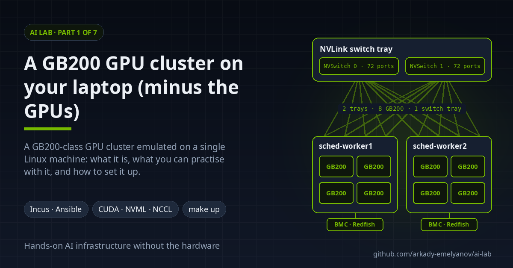
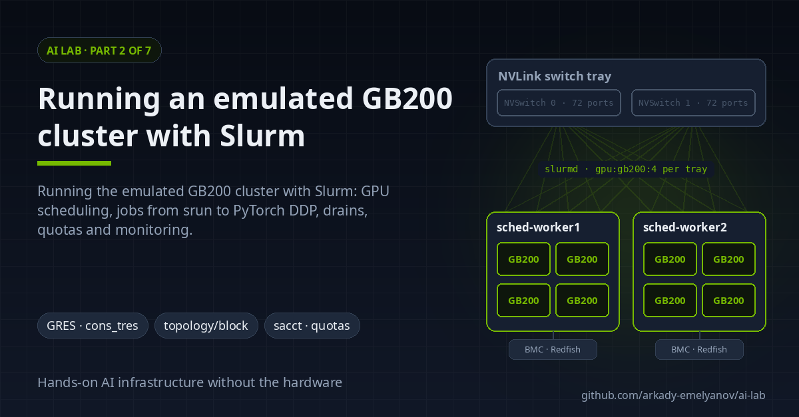
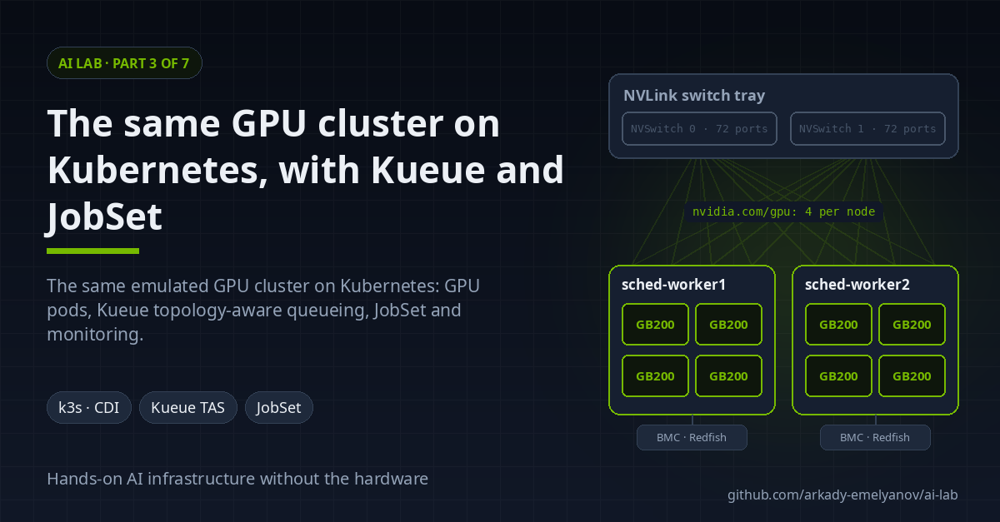
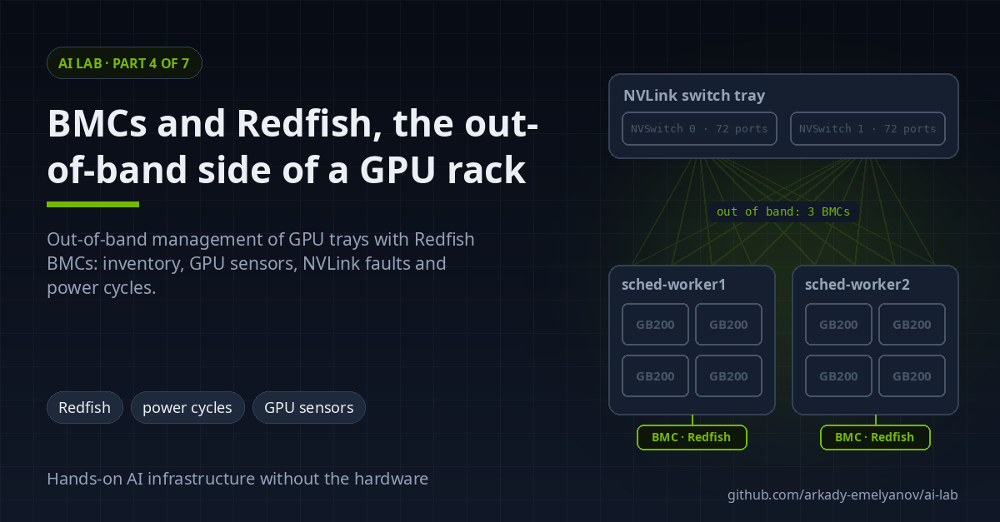
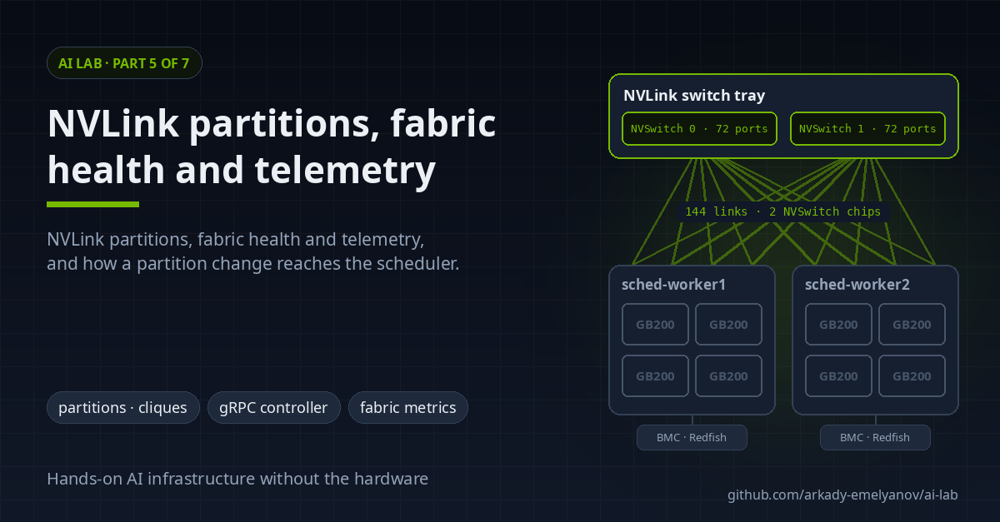
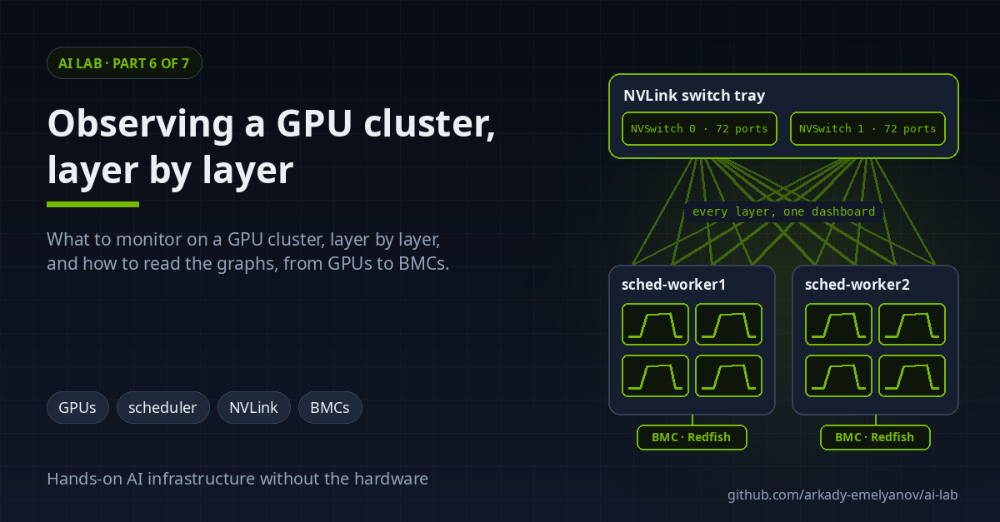
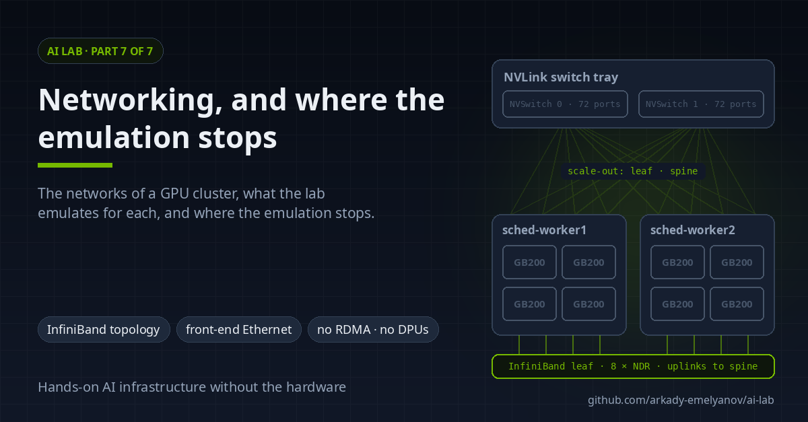

---
hide:
  - navigation
  - toc
image: "ai-lab/images/social/index.png"
description: "A GPU cluster emulated on a single Linux machine for systems engineers without GB200 hardware: setup, Slurm, Kubernetes, BMCs, NVLink, observability and networking."
---

# AI lab

[ai-lab](https://github.com/arkady-emelyanov/ai-lab) is a complete GPU cluster that runs on a single Linux machine: one NVIDIA GB200-class NVL8 NVLink domain, emulated in Incus containers, with Slurm or Kubernetes, BMCs, an NVLink switch tray, storage and monitoring around it. The GPUs are fake; everything around them is real.

> Independent personal project, not affiliated with or endorsed by NVIDIA. It emulates NVIDIA hardware interfaces in software for research and education.

-   

    **[Part 1: Intro](01-intro.md)**: what the lab is, what you can do with it, and how to set it up.

-   

    **[Part 2: Slurm](02-slurm.md)**: GPU scheduling, jobs from `srun` to PyTorch DDP, drains, quotas and monitoring.

-   

    **[Part 3: Kubernetes](03-kubernetes.md)**: the same hardware with k3s, Kueue and JobSet.

-   

    **[Part 4: BMC and Redfish](04-bmc-redfish.md)**: out-of-band management, NVLink faults and power cycles.

-   

    **[Part 5: NVLink](05-nvlink.md)**: partitions, fabric health and telemetry, and how they reach the scheduler.

-   

    **[Part 6: Observability](06-observability.md)**: what to monitor on a GPU cluster, layer by layer, and how to read the graphs.

-   

    **[Part 7: Networking](07-networking.md)**: the networks of a GPU cluster and where the emulation stops.

